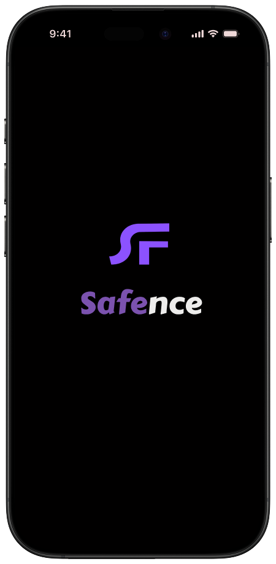
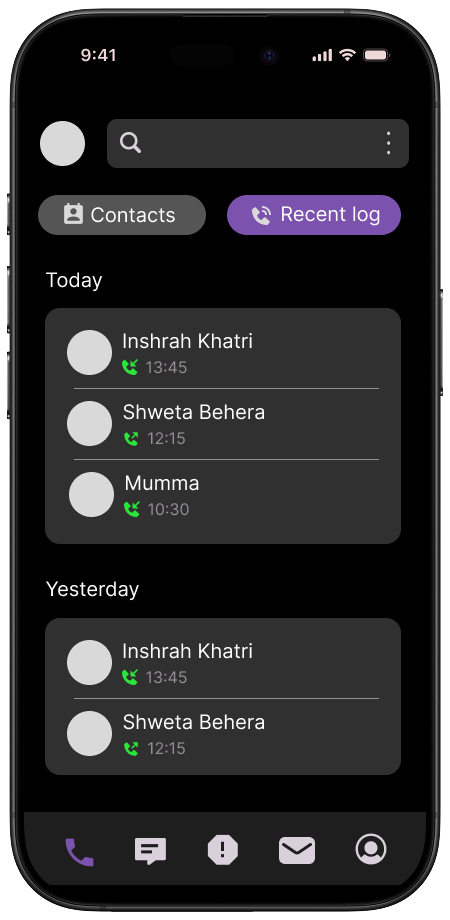
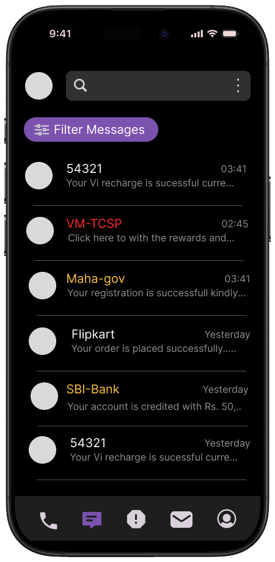

  
  
  

# Safence

**Safence** is an application designed for secure communication, emphasizing user privacy while providing robust contact, call, and message management features.  

---

## Features

- **Contact Management**: View, search, and interact with your device's contacts.  
- **Call History**: Display a detailed log of recent calls, including missed, outgoing, and incoming calls.  
- **Direct Calling**: Make phone calls directly from the application.  
- **SMS Management**: Send and view messages securely.  
- **Secure Storage**: Utilizes `flutter_secure_storage` for safely storing sensitive user data.  
- **State Management**: Built with the `provider` package for efficient and scalable state management.  
- **Permissions Handling**: Gracefully requests and handles necessary permissions for contacts, calls, and messages.  

---

## Dependencies

The project relies on the following key packages:  

- `flutter`: Core framework for building the app.  
- `provider`: For state management.  
- `flutter_contacts`: To access and manage device contacts.  
- `call_log`: To retrieve the device's call history.  
- `phone_state`: To listen for phone call state changes.  
- `permission_handler`: To manage runtime permissions.  
- `url_launcher`: To make phone calls.  
- `flutter_secure_storage`: For secure data storage.  
- `cupertino_icons`: For iOS-style icons.  
- `flutter_svg`: For rendering SVG assets.  
- `jwt_decode`: For decoding JSON Web Tokens.  

---

