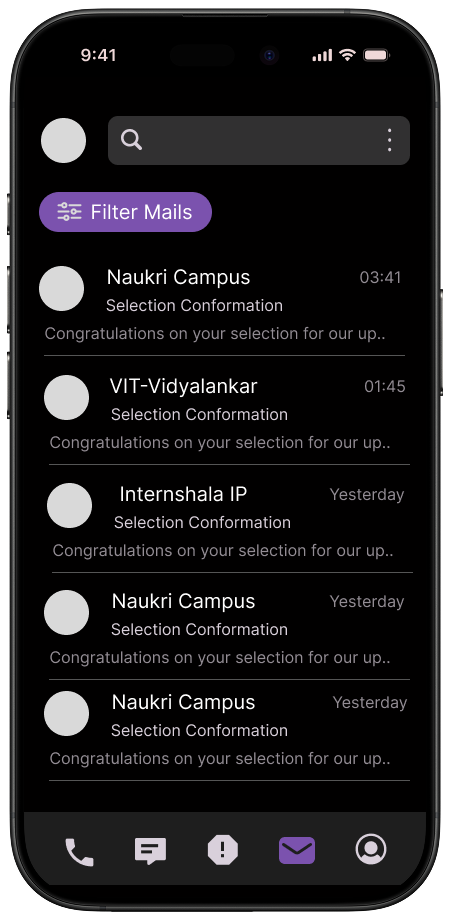
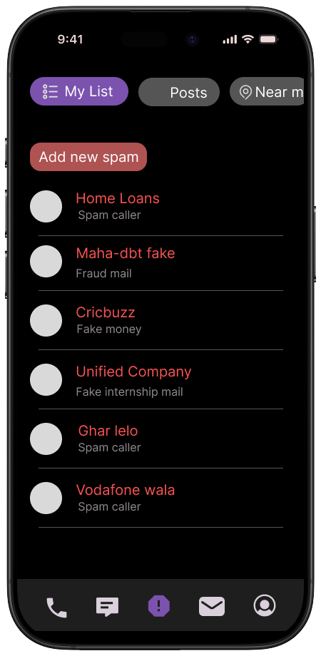

  
  
  
  

# Safence

**Safence** is an application designed for secure communication, emphasizing user privacy while providing robust contact, call, and message management features.  

---

## Spam Protection

<table>
  <tr>
    <td width="320" valign="top" align="center">
      
    </td>
    <td valign="top">
      
<strong>Manage and classify unwanted communication</strong>

      
Safence classifies potential spam across calls, SMS, and emails using detection rules and labeling, so you can:

      <ul>
        <li>Automatically flag or categorize suspected spam calls and messages</li>
        <li>Review a dedicated spam inbox for SMS and emails</li>
        <li>Quickly block repeat offenders and report spam</li>
        <li>Keep your main inbox and call history clean and focused</li>
      </ul>
      <blockquote>
        <em>Note:</em> Permissions are required to analyze call logs and messages. Email spam classification depends on your connected provider’s capabilities.
      </blockquote>
    </td>
  </tr>
</table>

---

## Features

- **Contact Management**: View, search, and interact with your device's contacts.  
- **Call History**: Display a detailed log of recent calls, including missed, outgoing, and incoming calls.  
- **Direct Calling**: Make phone calls directly from the application.  
- **SMS Management**: Send and view messages securely.  
- **Secure Storage**: Utilizes `flutter_secure_storage` for safely storing sensitive user data.  
- **State Management**: Built with the `provider` package for efficient and scalable state management.  
- **Permissions Handling**: Gracefully requests and handles necessary permissions for contacts, calls, and messages.  

---